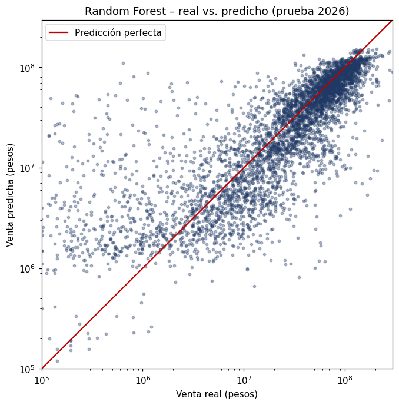
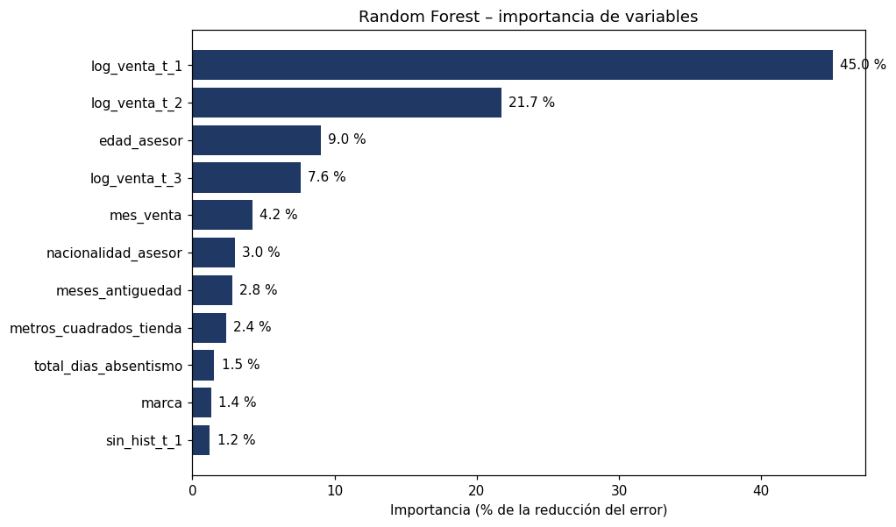

# Predicción de venta mensual por asesor · Retail de moda

Modelo de *machine learning* que estima la **venta del próximo mes de cada asesor comercial** a partir de su historial reciente, su perfil y las características de la tienda. Proyecto de la Maestría en Ciencia de Datos desarrollado con la metodología **CRISP-DM**.

   🔗 **App en línea:** https://prediccion-ventas-asesor.streamlit.app

---

## Resultados

Evaluación final con datos que el modelo nunca vio (enero–agosto 2026):

| Modelo | MAE (pesos) | RMSE (pesos) | R² | Mejora vs. línea base |
|---|---|---|---|---|
| Línea base: "vende lo mismo que el mes anterior" | 26.309.923 | 44.710.169 | −0,08 | — |
| Regresión Ridge | 20.541.269 | 32.574.037 | 0,42 | 21,9 % |
| Árbol de regresión | 16.805.565 | 26.799.675 | 0,61 | 36,1 % |
| **Random Forest (modelo seleccionado)** | **15.668.156** | **25.481.387** | **0,65** | **40,4 %** |

El modelo se eligió con **validación cruzada temporal** (5 bloques de meses de 2024–2025) antes de evaluar en 2026.



### ¿Qué pesa más en la predicción?

La venta de los tres meses anteriores explica el 74 % de la importancia del modelo; la temporada (mes), el perfil del asesor y la tienda afinan la estimación.



---

## Metodología (resumen)

- **Datos:** 17.603 registros asesor-mes (abril 2024 – agosto 2026), 2.237 asesores y 151 tiendas.
- **Preparación:** validación de integridad, perfilamiento, reglas de calidad, variables nuevas (`sin_hist`, antigüedad, `log1p` de los rezagos) y selección de factores con 4 métodos (correlación, índice de ganancia, árbol de decisión y regresión logística).
- **Evaluación sin fuga de información:** partición temporal (2024–2025 entrenamiento | 2026 prueba), preprocesamiento dentro de un `Pipeline` y validación cruzada por bloques de meses.
- **Modelos comparados:** Ridge, árbol de regresión y Random Forest, con diagnóstico de sobreajuste (brecha entrenamiento–validación ≤ 20 %).

## Estructura del repositorio

```
proyecto-ventas-ml/
├── app.py                        # Interfaz Streamlit
├── utils.py                      # Ingeniería de características (compartida por notebooks y app)
├── modelo_final.joblib           # Pipeline entrenado (Random Forest)
├── variables_seleccionadas.json  # Variables que usa el modelo
├── requirements.txt              # Dependencias con versiones fijas
├── notebooks/
│   ├── 01_preparacion_seleccion_factores.ipynb
│   └── 02_modelamiento_evaluacion.ipynb
└── assets/
    ├── importancia_variables.png
    └── real_vs_predicho.png
```

## Cómo ejecutar la app localmente

```bash
pip install -r requirements.txt
streamlit run app.py
```

## Datos

La base original contiene información de personas (edad, nacionalidad, ventas) y **no se publica** en este repositorio. Los notebooks muestran el proceso completo con sus resultados.

## Limitaciones

- Predice un mes adelante; para meses posteriores se requiere la venta real del mes previo.
- La prueba 2026 no incluye diciembre, el mes de mayor venta.
- En promedio subestima a los asesores de venta alta, y los errores relativos son grandes en meses de venta muy baja.
- Las relaciones que usa el modelo son asociaciones, no causas.

---

**Autor:** Geovanny Andrés Velasco Ospina · Maestría en Ciencia de Datos
